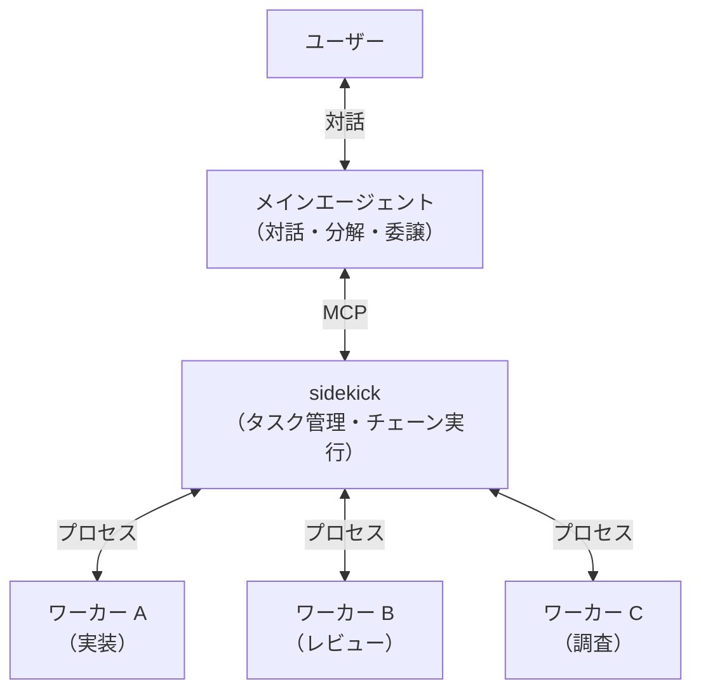
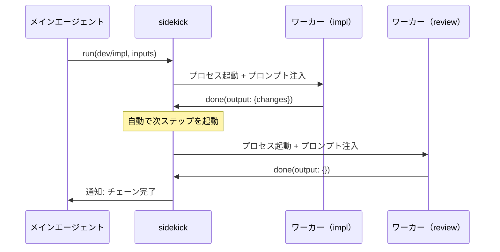

---
tags:
  - decision
  - sidekick
  - agent-orchestration
  - mcp
  - design-philosophy
---
# sidekick 設計思想

depends-on:
- [sidekick 要件定義](./2026-03-29-sidekick-requirements.md)

## ポリシー

**ベストプラクティスを意識させない**: sidekick を通すだけで、エビデンス検証・段階的開示・Intent Gate が適用される。プロンプトにルールを書き連ねなくても、正しいやり方がデフォルトになる設計。

**ハーネスに徹する**: LLM の推論能力やコンテキスト理解は急速に進歩する。sidekick はそれらを代替せず、構造的な制約と検証だけを担う。エージェントの能力が正しく発揮される枠組みを提供する。

## コアバリュー

**ハルシネーションの抑制**: エージェント間のタスク委譲にエビデンス（citation）を構造化して添付し、sidekick が存在検証を自動化する。

**段階的開示**: ワーカーのコンテキストに入る情報をプロセス分離でアーキテクチャレベルで制御する。

**宣言的ワークフロー**: タスクの種類・入出力・チェーンを frontmatter で宣言し、コード変更なしでワークフローを追加・変更できる。

## コンセプト

sidekick は、メインエージェントをユーザーとの唯一の対話インターフェースとし、複数のワーカーエージェントを協調させるオーケストレーターである。

ユーザーからの要求はメインエージェントがタスクに分解し、sidekick がそれぞれを適切なワーカーに委譲する。ワーカーは独立したプロセスとして作業を実行し、結果を sidekick 経由でメインエージェントに返す。



## 解くべき問題

Claude Code の標準的な Agent ツールでもサブエージェントは起動できる。しかし以下の制約がある。

**コンテキスト制御の欠如**: Agent ツールはプロンプト文字列を渡すだけで、ワーカーに何が見えるかを構造的に制御できない。メインエージェントの要約品質に依存し、必要以上の情報が渡されたり、必要な情報が欠落する。

**チェーン制御の欠如**: A の結果を B に渡し、B の結果を C に渡す——このような多段パイプラインを宣言的に定義・制御する手段がない。

**エビデンスなき委譲**: タスクを委譲する際、「なぜそう判断したか」の根拠が構造化されていない。メインエージェントが hallucinate した要件がそのままワーカーに渡るリスクがある。

## 設計判断

### 1. エージェントをプロセスで分離する

ワーカーエージェントを独立プロセスとして起動する。これにより:

- **段階的開示**: メインエージェントの hooks・設定・会話履歴がワーカーに漏洩しない。ワーカーには sidekick がワークフロー定義とタスク入力だけを注入する
- **分解と実行の分離**: メインエージェントは実行しない。ワーカーはユーザーと対話しない。プロセスが分かれているため、この境界を構造的に破れない
- **チェーンの自動化**: sidekick がプロセス間のデータ受け渡しを管理するため、メインエージェントのコンテキストを経由せずに A→B→C を実行できる



### 2. タスクを宣言的に定義する

ワークフロー（タスクの種類と手順）を Markdown ファイルの frontmatter + 本文として宣言的に定義する。

```yaml
# skills/dev/impl.md
---
description: コードを実装する
inputs:
  what: 実装内容                # 短縮形 → evidenced（citation 必須）
  where:
    description: 対象ファイル
    type: plain                 # ファイルパスなので plain
confirm-before-run: true
next: review                    # 完了後に review を自動実行
---

（ワーカーへの作業指示がここに書かれる）
```

これにより:

- **委譲可否の宣言的な判断基準**: メインエージェントは「このタスクをワーカーに委譲できるか」を、ワークフローの `inputs` を埋められるかどうかで判断する。曖昧な基準ではなく、宣言された入力パラメータに対する充足チェックで委譲可否が決まる。inputs を「埋められる」とは、ユーザーとの対話履歴や既存のコード・ドキュメントをポイントしてワーカーに伝えられるということである
- **オーケストレーターとワークフローの分離**: sidekick はワークフローの中身を知らない。タスクタイプで委譲するだけ。新しいワークフローの追加に sidekick のコード変更は不要（[エージェントアーキテクチャ: 3層分離](https://github.com/oda251/chezmoi-dotfiles/blob/main/ai-agent-configs/references/setup/agent-architecture.md)）
- **チェーンの宣言**: `next` フィールドで後続ステップを宣言する。sidekick が `next` を辿り、後続ステップの `inputs` から自動的に output 要件を逆算する
- **入出力の型安全**: `inputs` / outputs（next から自動解決）の不足は、実行前・完了前にバリデーションされる。暗黙の補完はしない

### 3. エビデンス付きで委譲する

各 input は本文（body）とエビデンス（citations）で構成される。

```json
{
  "what": {
    "body": "セッションベースの認証を JWT に移行する",
    "citations": [
      { "type": "transcript", "excerpt": "移行中もセッションを切りたくない" },
      { "type": "uri", "source": "src/auth/session.ts:15-40", "excerpt": "app.use(session(...))" }
    ]
  }
}
```

- ワーカーは本文だけで作業を始められる。必要に応じて citation の原典を辿る
- `transcript` 型の citation は、sidekick が保持する会話履歴ファイルで解決される
- エビデンスの存在検証（excerpt が source に実在するか）を自動化できる構造になっている

## メインエージェントの役割

sidekick はワーカーの管理を担うが、ユーザーとの対話はメインエージェントの責務である。メインエージェントは:

1. ユーザーの要求をタスクに分解する
2. `confirm-before-run: true` のタスクをユーザーに提示して承認を得る
3. sidekick にタスクを投入する
4. sidekick からの完了・失敗通知を受け取り、ユーザーに報告する

メインエージェントの振る舞いは hooks で注入される。この hooks はワーカーには継承されない——これが sidekick でプロセス分離する最大の理由である。

## ベストプラクティスを設計で実践する

LLM エージェントのベストプラクティスは多くの場合「プロンプトでこう書け」という運用ルールにとどまる。sidekick はこれらをアーキテクチャに組み込み、構造的に強制する。

- **エビデンス検証**: 「出典を確認しろ」というプロンプト指示ではなく、evidenced input の citation が source に実在するかを sidekick がタスク投入前に自動検証する。見つからなければ差し戻す
- **Intent Gate**: 「要件が不十分なら作業を始めるな」というプロンプト指示ではなく、ワーカーの共通フローに reject 機構が組み込まれている。ワーカーは inputs を確認し、不十分なら reject で差し戻す。この判断はプロンプトの善意ではなくプロトコルとして保証される
- **段階的開示**: 「余計な情報を渡すな」という指示ではなく、プロセス分離により物理的にワーカーのコンテキストを制御する

## 技術選択

**MCP (Model Context Protocol)**: タスクの完了・失敗をメインエージェントに通知できるプロトコルとして採用。sidekick がサーバー、メインエージェントがクライアントとなり、ワーカーの作業完了時にメインエージェントへ非同期に通知を送る。

## 拡張の方向性

- **エビデンス検証の強化**: 現在は excerpt の存在チェック（grep / HEAD）。NLI モデルによるセマンティック検証、LLM を使った引用の妥当性判定などで精度を向上できる（[NLI 調査](./2026-03-30-res-nli-citation-verification.md)）
- **再帰的タスク分解**: タスクの投入はメインエージェントに限定されない。通知は投入元のセッションに返るため、ワーカーが自らサブタスクを投入し、その完了を受け取ることができる
- **ワーカー実装の差し替え**: 現在ワーカーは Claude Code サブプロセスだが、sidekick が関心を持つのは inputs を渡して done/reject を受け取ることだけである。ワーカーの実装を別のモデル、外部 API、人間のレビューなどに差し替えられる
- **条件付き next**: ワーカーの output に応じて後続ステップを分岐する。frontmatter で条件と遷移先を宣言的に定義
- **外部承認**: Slack 等への承認フロー連携
- **スケジュール実行**: cron で定期的にワークフローを起動する

## 未実装

- **inputs の参照渡し**: [検討ドキュメント](./2026-03-30-con-sidekick-input-references.md)を参照
