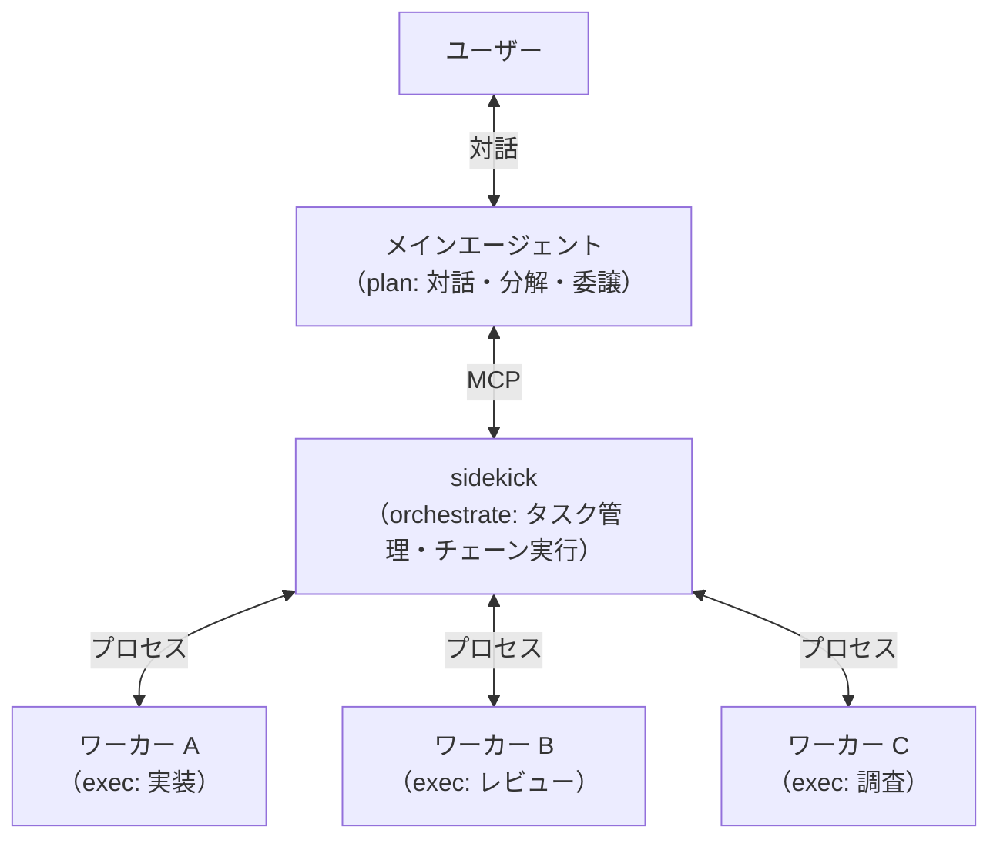
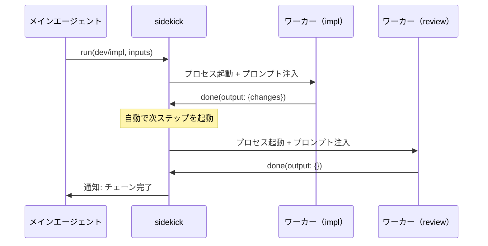

---
tags:
  - decision
  - sidekick
  - agent-orchestration
  - mcp
  - design-philosophy
---
# sidekick 設計思想

depends-on:
- [sidekick 要件定義](./2026-03-29-sidekick-requirements.md)

## コンセプト

sidekick は、メインエージェントをユーザーとの唯一の対話インターフェースとし、複数のワーカーエージェントを協調させるオーケストレーターである。

ユーザーからの要求はメインエージェントがタスクに分解し、sidekick がそれぞれを適切なワーカーに委譲する。ワーカーは独立したプロセスとして作業を実行し、結果を sidekick 経由でメインエージェントに返す。



## 解くべき問題

Claude Code の標準的な Agent ツールでもサブエージェントは起動できる。しかし以下の制約がある。

**コンテキスト汚染**: メインエージェントの設定（CLAUDE.md、hooks）がサブエージェントに暗黙的に継承される。「計画だけする」はずのメインエージェントの指示が、実行担当のワーカーの振る舞いを歪める（[コンテキスト分離設計](https://github.com/oda251/chezmoi-dotfiles/blob/main/docs/design/2026-03-19-orchestrator-context-isolation.md)）。

**チェーン制御の欠如**: A の結果を B に渡し、B の結果を C に渡す——このような多段パイプラインを宣言的に定義・制御する手段がない。

**タスク状態の揮発性**: Agent ツールで起動したサブエージェントの進捗や結果は、メインエージェントのコンテキスト内にしか存在しない。セッションを跨いだ追跡ができない。

## 2つの設計判断

sidekick の設計は、大きく2つの判断に集約される。

### 1. エージェントをプロセスで分離する

ワーカーエージェントを独立プロセスとして起動する。これにより:

- **コンテキスト分離**: メインエージェントの hooks・設定・会話履歴がワーカーに漏洩しない。ワーカーには sidekick がワークフロー定義とタスク入力だけを注入する
- **分解と実行の分離**: メインエージェントは実行しない。ワーカーはユーザーと対話しない。プロセスが分かれているため、この境界を構造的に破れない
- **チェーンの自動化**: sidekick がプロセス間のデータ受け渡しを管理するため、メインエージェントのコンテキストを経由せずに A→B→C を実行できる



### 2. タスクを宣言的に定義する

ワークフロー（タスクの種類と手順）を Markdown ファイルの frontmatter + 本文として宣言的に定義する。

```yaml
# skills/dev/impl.md
---
description: コードを実装する
inputs:
  what: 実装内容
  where: 対象ファイル
confirm-before-run: true
next: review                  # 完了後に review を自動実行
---

（ワーカーへの作業指示がここに書かれる）
```

これにより:

- **委譲可否の宣言的な判断基準**: メインエージェントは「このタスクをワーカーに委譲できるか」を、ワークフローの `inputs` を埋められるかどうかで判断する。曖昧な基準ではなく、宣言された入力パラメータに対する充足チェックで委譲可否が決まる。inputs を「埋められる」とは、ユーザーとの対話履歴や既存のコード・ドキュメントをポイントしてワーカーに伝えられるということである
- **オーケストレーターとワークフローの分離**: sidekick はワークフローの中身を知らない。タスクタイプで委譲するだけ。新しいワークフローの追加に sidekick のコード変更は不要（[エージェントアーキテクチャ: 3層分離](https://github.com/oda251/chezmoi-dotfiles/blob/main/ai-agent-configs/references/setup/agent-architecture.md)）
- **チェーンの宣言**: `next` フィールドで後続ステップを宣言する。sidekick が `next` を辿り、後続ステップの `inputs` から自動的に output 要件を逆算する
- **入出力の型安全**: `inputs` / outputs（next から自動解決）の不足は、実行前・完了前にバリデーションされる。暗黙の補完はしない

```
skills/
  dev/
    impl.md       → next: review → outputs: {changes} が自動解決される
    review.md     ← internal: true（直接実行不可、チェーン専用）
  research/
    gather.md     → next: write → outputs: {findings} が自動解決される
    write.md      ← internal: true
```

ドメインの追加はディレクトリとファイルを足すだけ。コード変更ゼロで新しいタスクタイプが利用可能になる。

## メインエージェントの役割

sidekick はワーカーの管理を担うが、ユーザーとの対話はメインエージェントの責務である。メインエージェントは:

1. ユーザーの要求をタスクに分解する
2. `confirm-before-run: true` のタスクをユーザーに提示して承認を得る
3. sidekick にタスクを投入する
4. sidekick からの完了・失敗通知を受け取り、ユーザーに報告する

メインエージェントの振る舞いは hooks で注入される。この hooks はワーカーには継承されない——これが sidekick でプロセス分離する最大の理由である。

## 技術選択

**MCP (Model Context Protocol)**: タスクの完了・失敗をメインエージェントに通知できるプロトコルとして採用。sidekick がサーバー、メインエージェントがクライアントとなり、ワーカーの作業完了時にメインエージェントへ非同期に通知を送る。

## 拡張の方向性

sidekick の現在のスコープは「宣言的なワークフロー定義に基づく、プロセス分離されたエージェントのチェーン実行」に限定されている。以下は意図的に v0.1 のスコープ外としたが、アーキテクチャはこれらを妨げない:

- **再帰的タスク分解**: タスクの投入はメインエージェントに限定されない。通知は投入元のセッションに返るため、ワーカーが自らサブタスクを投入し、その完了を受け取ることができる
- **エビデンス検証**: inputs の引用（citation）には source と excerpt が含まれる。sidekick がタスク投入時に「excerpt が source に実際に存在するか」を自動検証できる。エージェントの hallucination による誤った引用をワーカーに渡す前に検出する
- **ワーカー実装の差し替え**: 現在ワーカーは Claude Code サブプロセスだが、sidekick が関心を持つのは inputs を渡して done/reject を受け取ることだけである。ワーカーの実装を別のモデル、外部 API、人間のレビューなどに差し替えられる
- **タスク永続化**: インメモリの TaskStore をファイルベースにし、セッション跨ぎで状態を保持する
- **外部承認**: Slack 等への承認フロー連携
- **スケジュール実行**: cron で定期的にワークフローを起動する

## 未実装

- **inputs の参照渡し**: [検討ドキュメント](./2026-03-30-con-sidekick-input-references.md)を参照
