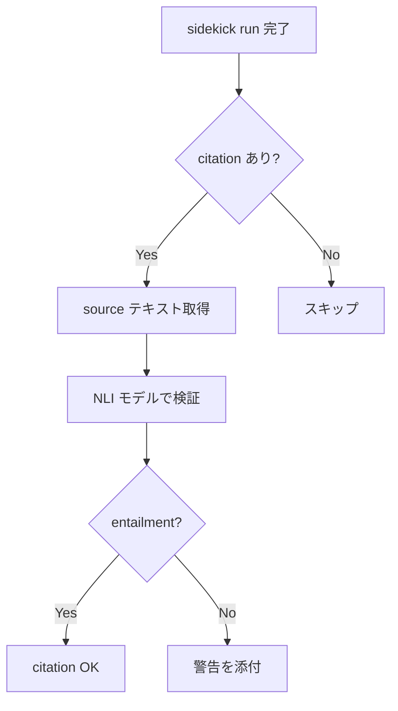

---
tags:
  - research
  - nli
  - citation-verification
  - transformers-js
  - sidekick
---
# NLI モデルによる citation 検証の調査

## 1. NLI (Natural Language Inference) とは

NLI は「Recognizing Textual Entailment (RTE)」とも呼ばれ、2つのテキスト間の論理的関係を判定するタスク（[Wikipedia: Textual entailment](https://en.wikipedia.org/wiki/Textual_entailment)）。

- **入力**: premise（前提）と hypothesis（仮説）のテキストペア
- **出力**: 3 クラス分類
  - **entailment** — premise が hypothesis を支持する
  - **contradiction** — premise が hypothesis と矛盾する
  - **neutral** — どちらでもない

代表的なデータセット:
- **SNLI** (570K ペア) — Stanford が構築した最初の大規模 NLI データセット（[Stanford NLP: SNLI](https://nlp.stanford.edu/projects/snli/)）
- **MultiNLI (MNLI)** (433K ペア) — ジャンル横断のベンチマーク
- **ANLI** — adversarial に構築された高難易度データセット
- **FEVER** — 事実検証特化
- **DocNLI** — ドキュメントレベルの長文 NLI

## 2. 主要なモデル

### 2.1 Hugging Face で利用可能なモデル一覧

| モデル | パラメータ | MNLI-m | ANLI-all | 出力クラス | ONNX 対応 |
|---|---|---|---|---|---|
| DeBERTa-v3-large-mnli-fever-anli-ling-wanli | 400M | 91.2% | 70.2% | 3 | あり |
| DeBERTa-v3-base-mnli-fever-anli | 200M | 90.3% | 57.9% | 3 | Xenova 版あり |
| DeBERTa-v3-base-mnli-fever-docnli-ling-2c | 200M | 93.5% (2c) | 71.0% (2c) | 2 | なし (要変換) |
| cross-encoder/nli-deberta-v3-xsmall | 71M | 87.8% (mm) | - | 3 | Xenova 版あり |
| cross-encoder/nli-deberta-v3-small | ~140M | ~90% | - | 3 | Xenova 版あり |
| facebook/bart-large-mnli | 400M | - | - | 3 | あり |

（各数値は [MoritzLaurer/DeBERTa-v3-large-mnli-fever-anli-ling-wanli](https://huggingface.co/MoritzLaurer/DeBERTa-v3-large-mnli-fever-anli-ling-wanli)、[MoritzLaurer/DeBERTa-v3-base-mnli-fever-anli](https://huggingface.co/MoritzLaurer/DeBERTa-v3-base-mnli-fever-anli)、[MoritzLaurer/DeBERTa-v3-base-mnli-fever-docnli-ling-2c](https://huggingface.co/MoritzLaurer/DeBERTa-v3-base-mnli-fever-docnli-ling-2c)、[cross-encoder/nli-deberta-v3-xsmall](https://huggingface.co/cross-encoder/nli-deberta-v3-xsmall) の各モデルカードより）

**注目: DeBERTa-v3-base-mnli-fever-docnli-ling-2c** は DocNLI を含む 8 つの NLI データセットで学習されており、長文の推論に強い。citation 検証では source テキストが長くなるため、このモデルが最適候補。ただし 2 クラス (entailment / not_entailment) なので contradiction と neutral を区別できない（[MoritzLaurer/DeBERTa-v3-base-mnli-fever-docnli-ling-2c](https://huggingface.co/MoritzLaurer/DeBERTa-v3-base-mnli-fever-docnli-ling-2c)）。

### 2.2 API として使えるもの

- **Hugging Face Inference API**: 無料枠あり（数百リクエスト/時間程度）。PRO ($9/月) で月 2M credits。CPU 推論が中心で、zero-shot-classification パイプラインをそのまま利用可能（[Hugging Face Pricing](https://huggingface.co/pricing)、[HF Forums: Rate limits](https://discuss.huggingface.co/t/api-inference-limit-changed/144157)）
- **Dedicated Inference Endpoints**: Hugging Face でホスティング。GPU 利用可能だがコスト高

### 2.3 ローカル軽量モデル（Bun/Node.js から呼べるか）

Transformers.js v4 が Bun / Node.js / Deno をサポートしており、ONNX 形式のモデルをローカルで推論可能（[Transformers.js GitHub](https://github.com/huggingface/transformers.js)）。

```javascript
import { pipeline } from '@huggingface/transformers';

const classifier = await pipeline(
  'zero-shot-classification',
  'Xenova/nli-deberta-v3-xsmall'
);
const result = await classifier(
  'The cat sat on the mat.',
  ['The cat is on the mat.', 'The dog is running.']
);
```

Xenova が ONNX 変換済みモデルを公開しており、すぐに利用可能:
- `Xenova/nli-deberta-v3-xsmall` (71M params)（[Xenova/nli-deberta-v3-xsmall](https://huggingface.co/Xenova/nli-deberta-v3-xsmall)）
- `Xenova/nli-deberta-v3-small`
- `Xenova/nli-deberta-v3-base`
- `Xenova/DeBERTa-v3-base-mnli-fever-anli`（[Xenova/DeBERTa-v3-base-mnli-fever-anli](https://huggingface.co/Xenova/DeBERTa-v3-base-mnli-fever-anli)）

## 3. Citation 検証への適用方法

### 3.1 基本アプローチ

```
premise  = source のテキスト（元文書の該当箇所）
hypothesis = citation の excerpt（引用テキスト）
→ entailment なら「excerpt は source に裏付けられている」
→ contradiction なら「excerpt は source と矛盾している」
→ neutral なら「source からは excerpt を導けない」
```

### 3.2 先行研究と精度

- **TRUE モデル**: Honovich et al. (2022) が提案した NLI ベースの事実整合性評価モデル。T5 ベースで、citation 検証の標準ツールとして広く使われている（[TRUE: Re-evaluating Factual Consistency Evaluation](https://www.researchgate.net/publication/361069161_TRUE_Re-evaluating_Factual_Consistency_Evaluation)）
- **AIS (Attributable to Identified Sources)**: NLI モデルで「生成テキストの各文がソースドキュメントに entail されるか」を自動判定する AutoAIS メトリクスとして実装されている（[VeriCite](https://arxiv.org/html/2510.11394)）
- **VeriCite**: TRUE NLI モデルを使い、3 段階（生成 → 検証 → 修正）で citation 品質を向上。Citation F1 で既存手法を上回る結果（[VeriCite](https://arxiv.org/html/2510.11394)）
- **CiteVerifier**: 小型・軽量モデルで 80% の true sample 精度、Exact Accuracy 58%。低リソース環境向け（[CiteVerifier: ICCS 2025](https://www.iccs-meeting.org/archive/iccs2025/papers/159110235.pdf)）

### 3.3 限界・落とし穴

1. **長文の扱い**: 標準 NLI モデルは文ペアで学習されており、長い source テキストでは精度が下がる。DocNLI で学習されたモデル（DeBERTa-v3-base-mnli-fever-docnli-ling-2c）が必要（[MoritzLaurer/DeBERTa-v3-base-mnli-fever-docnli-ling-2c](https://huggingface.co/MoritzLaurer/DeBERTa-v3-base-mnli-fever-docnli-ling-2c)）
2. **暗黙の含意**: 明示的な entailment は得意だが、暗黙の含意 (implicit entailment) ではチャンスレベルまで精度が落ちるという報告あり（[NLI Comprehensive Guide 2025](https://www.shadecoder.com/topics/natural-language-inference-a-comprehensive-guide-for-2025)）
3. **数値・時間表現**: 数量比較や時間参照を含む claims は NLI モデルにとって固有の課題（[DS@GT CheckThat! 2025](https://arxiv.org/html/2507.06195)）
4. **部分情報**: TRUE T5 モデルは citation の完全性検証は得意だが、部分的な情報しかない場合に精度が落ちる（[CiteVerifier](https://www.iccs-meeting.org/archive/iccs2025/papers/159110235.pdf)）
5. **compositionality**: Atomic-SNLI の研究で、atomic レベルの精度が文レベルと同等かそれ以下であることが示されており、複合的な主張の検証は困難（[Atomic-SNLI](https://arxiv.org/html/2601.06528)）
6. **トークン長制限**: DeBERTa 系は通常 512 トークンが上限。長い source は切り詰めが必要

## 4. 実行環境の選択肢

### 4.1 Transformers.js (ONNX Runtime)

- **対応ランタイム**: Node.js, Bun, Deno, ブラウザ（[Transformers.js GitHub](https://github.com/huggingface/transformers.js)）
- **バージョン**: v4.0.0 が最新安定版
- **推論バックエンド**: ONNX Runtime (CPU: WASM, GPU: WebGPU)
- **NLI パイプライン**: `zero-shot-classification` で直接利用可能
- **レイテンシ目安**: ONNX Runtime + CPU で DeBERTa-xsmall クラスなら数十〜数百 ms/ペア程度（未検証、モデルサイズとテキスト長に依存）
- **初回ロード**: モデルダウンロード + ONNX セッション初期化に数秒。2回目以降はキャッシュ

### 4.2 ONNX Runtime for Node.js（直接利用）

- `onnxruntime-node` パッケージで Transformers.js を介さず直接推論も可能
- より低レベルだが、前後処理（トークナイズ等）を自前実装する必要あり
- Transformers.js 経由の方が実用的

### 4.3 Hugging Face Inference API

- **メリット**: インフラ不要、モデル切り替えが容易
- **デメリット**: レイテンシ（ネットワーク往復）、レート制限、外部依存
- **コスト**: 無料枠で数百 req/h。PRO ($9/月) で拡張
- **向いているケース**: プロトタイプ、低頻度の利用

### 4.4 Claude API を NLI 的に使う

プロンプトで entailment 判定を依頼する方法:

```
以下の source と excerpt の関係を判定してください。
- entailment: source が excerpt を裏付けている
- contradiction: source が excerpt と矛盾している
- neutral: source からは excerpt を導けない

source: {source_text}
excerpt: {excerpt_text}

判定:
```

**コスト比較**:

| 方式 | 1 件あたりのコスト | レイテンシ | 精度 |
|---|---|---|---|
| ローカル NLI (Transformers.js) | ~0 円 (CPU のみ) | 50-300ms | 高 (MNLI 87-93%) |
| HF Inference API (無料) | 0 円 | 200-1000ms | 同上 |
| Claude Haiku | ~$0.001 (500 tokens 想定) | 500-2000ms | 非常に高い（未検証） |
| Claude Sonnet | ~$0.005 | 1000-3000ms | 非常に高い（未検証） |

Claude API は NLI モデルより柔軟（暗黙の含意、文脈理解に強い）だが、コストとレイテンシが桁違い。1 run で 5-20 citations を検証する場合、ローカル NLI なら数秒、Claude API なら数十秒 + 数セントかかる。

## 5. sidekick への統合案

### 5.1 推奨アーキテクチャ



### 5.2 検証タイミング

| タイミング | メリット | デメリット |
|---|---|---|
| **run 時 (リアルタイム)** | 即座にフィードバック | レイテンシ増加 |
| **done 時 (後処理)** | UX に影響なし | 結果が遅れる |
| **バッチ (定期)** | 効率的 | リアルタイム性なし |

**推奨: done 時**。run の結果を受け取った後、非同期で検証を走らせ、結果を metadata として添付する。ユーザー体験を損なわずに品質保証できる。

### 5.3 レイテンシ・コスト見積もり

前提: 1 回の調査で 10 citations、各 citation に source 300 tokens + excerpt 50 tokens

**ローカル NLI (DeBERTa-xsmall, Transformers.js)**:
- 初回ロード: 2-5 秒（モデルキャッシュ後は 0）
- 推論: 10 件 x 100-200ms = 1-2 秒
- コスト: 0 円
- 合計: 1-2 秒（キャッシュ済み）

**Hugging Face Inference API**:
- 10 件 x 300-500ms = 3-5 秒
- コスト: 無料枠内なら 0 円
- cold start リスクあり（サーバーレスモデルのウォームアップ）

**Claude Haiku**:
- 10 件 x 1-2 秒 = 10-20 秒（並列化で短縮可能）
- コスト: ~$0.01/回
- 月 1000 回なら ~$10/月

### 5.4 検証失敗時の挙動

段階的アプローチを推奨:

1. **entailment スコア高 (>0.8)**: そのまま通す
2. **entailment スコア中 (0.5-0.8)**: 警告ラベルを添付（`⚠ low confidence`）
3. **contradiction 判定**: エラーとして弾く or 強い警告
4. **neutral 判定**: 警告ラベルを添付（`excerpt may not be directly supported`）

検証結果は citation の metadata に `verified: true/false`, `nli_score: 0.85`, `nli_label: entailment` のように付与する。

### 5.5 実装の第一歩

1. `@huggingface/transformers` を依存に追加
2. `Xenova/nli-deberta-v3-xsmall` (71M) で PoC を作る — 最小・最速
3. 精度が不足なら `Xenova/DeBERTa-v3-base-mnli-fever-anli` (200M) にスケールアップ
4. DocNLI 対応が必要なら `DeBERTa-v3-base-mnli-fever-docnli-ling-2c` を ONNX 変換して利用

## 6. まとめ

| 観点 | 結論 |
|---|---|
| NLI は citation 検証に使えるか | 使える。premise=source, hypothesis=excerpt の構成で entailment 判定が可能 |
| 精度は十分か | MNLI 87-93%。明示的な含意には高精度。暗黙の含意・数値比較は弱い |
| ローカル実行は可能か | Transformers.js v4 + ONNX で Bun/Node.js から直接推論可能 |
| コスト | ローカル NLI なら 0 円。Claude API は月 $10 程度（1000 回利用） |
| 推奨モデル | まず xsmall (71M) で PoC、必要に応じて base (200M) or DocNLI 版へ |
| 推奨タイミング | done 時の非同期検証 |
